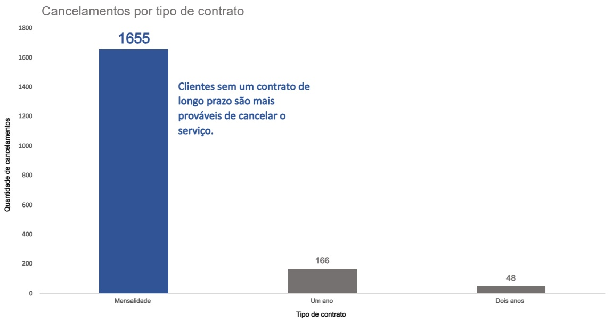
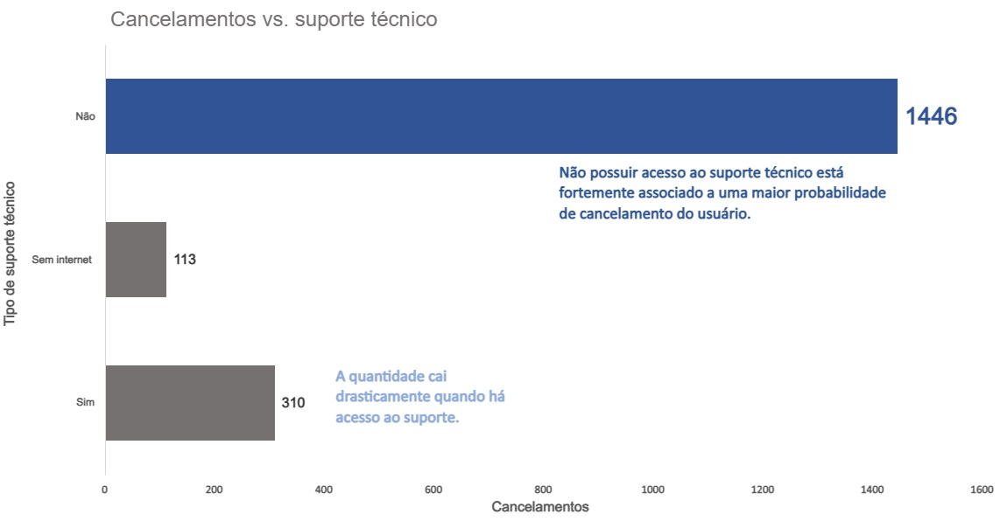
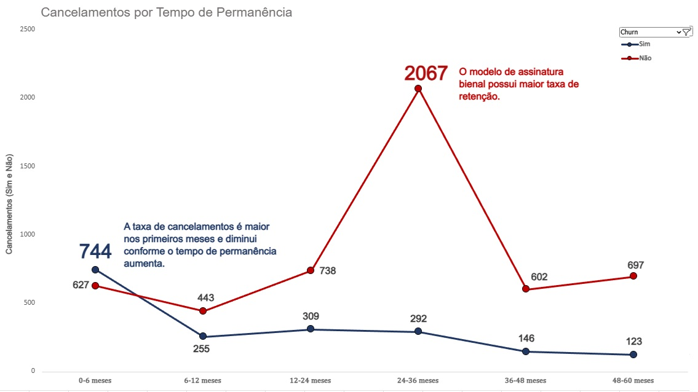

# Previsão de cancelamento de usuários
Projeto de análise e modelagem preditiva para identificar clientes com maior probabilidade de cancelamento (churn), utilizando técnicas de análise de dados e Machine Learning.
## 1. Introdução
A evasão de clientes é um dos principais desafios em negócios baseados em receita recorrente. Reduzir o churn impacta diretamente a retenção, o LTV (Lifetime Value) e a lucratividade.

Neste projeto, foi desenvolvido um pipeline completo de dados para:

- Analisar fatores que influenciam o churn
- Identificar padrões de comportamento dos clientes
- Construir um modelo preditivo robusto
- Gerar insights acionáveis para retenção
## 2. Fonte de dados
- Fonte: Kaggle (www.kaggle.com/datasets/blastchar/telco-customer-churn)
- Registros: 7.043 clientes
- Features: dados demográficos, serviços contratados e informações de pagamento

## 3. Pipeline do projeto
O projeto seguiu as seguintes etapas:

### 1. limpeza e tratamento de dados
- Conversão de variáveis (TotalCharges → numérico)
- Tratamento de valores ausentes (mediana)
- Encoding de variáveis categóricas (One-Hot Encoding)
- Transformação da variável alvo (Churn → binária)

### 2. Análise exploratória de dados (EDA)
Principais análises realizadas:
- Distribuição de churn
- Taxa de churn por:  
Tipo de contrato  
Método de pagamento  
Serviço de internet  

- Correlação entre variáveis numéricas

### 3. Modelagem preditiva
Modelos utilizados:
- Random Forest
- XGBoost
- Stacking Ensemble:  
Modelos base: Random Forest + XGBoost  
Meta-modelo: Logistic Regression  

Otimização:
- RandomizedSearchCV para tuning de hiperparâmetros

### 4. Avaliação de desempenho
Métricas utilizadas:
- ROC-AUC → capacidade de separação das classes
- F1-Score → equilíbrio entre precision e recall
- Matriz de Confusão → análise de erros
- Classification Report

## 4. Principais insights
Com base na análise e modelagem, foram identificados os seguintes insights:
### Impacto do tipo de contrato
- Clientes que possuem contrato mensal representam 88,55% dos cancelamentos.
- Contratos anuais e bienais somam menos de 15% dos cancelamentos totais. Isso mostra que contratos de longo prazo reduzem drasticamente a quantidade de cancelamentos.

  

### Importância do Suporte Técnico
- O maior número de cancelamentos ocorre entre clientes sem acesso ao suporte técnico.
- Clientes sem internet são o menor grupo. Isso indica que não dependem tanto do suporte técnico ou são um nicho específico.
- Quando há acesso ao suporte, a quantidade de cancelamentos é reduzida significativamente.

  

### Tempo de Permanência
- O maior número de cancelamentos ocorre entre 0 e 6 meses.
- Clientes que permanecem mais de 2 anos demonstram maior lealdade à empresa.
- Há um aumento expressivo de clientes ativos entre 24 e 36 meses. Isso indica que planos bienais são importantes para retenção de clientes.

  

## 5. Recomendações
1. Melhorar onboarding
- Acompanhamento nos primeiros meses
- Suporte proativo para novos clientes
2. Incentivar contratos longos
- Ofertas e benefícios para planos anuais/bienais
- Estratégias de upgrade
3. Fortalecer suporte técnico
- Reduzir tempo de atendimento
- Melhorar resolução no primeiro contato
4. Ações preditivas
- Usar o modelo para identificar clientes em risco
- Criar campanhas de retenção direcionadas

## 6. Tecnologias utilizadas
- Python
- Pandas / NumPy → manipulação de dados
- Matplotlib / Seaborn → visualização
- Scikit-learn → modelagem e avaliação
- XGBoost → boosting
- Imbalanced-learn (SMOTE) → balanceamento
## 7. Contato
Samuel Lellis

LinkedIn: https://www.linkedin.com/in/samuel-lellis-293258346  
GitHub: https://github.com/SamuelLellis1  
Email: samuellellis1337@gmail.com